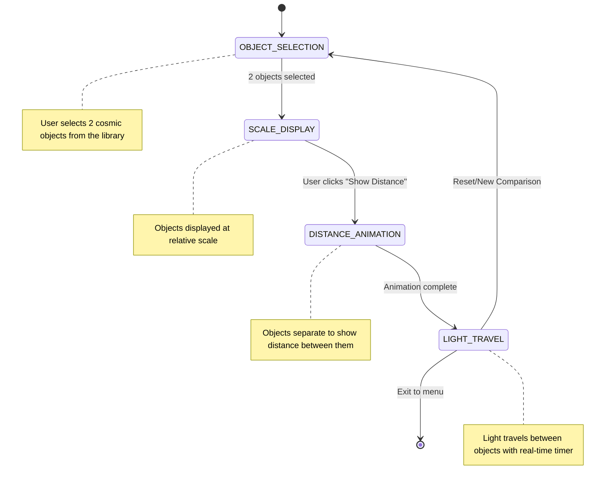

# Powers Explorer - Technical Architecture

> Comprehensive technical documentation for developers contributing to or extending the Powers Explorer project.

**Document Version**: 1.0
**Last Updated**: 2025-12-26
**Target Audience**: Software developers, technical reviewers, system architects

---

## Table of Contents

1. [System Overview](#system-overview)
2. [Architecture Patterns](#architecture-patterns)
3. [Technology Stack](#technology-stack)
4. [Scene Architecture](#scene-architecture)
5. [Component Design](#component-design)
6. [Data Architecture](#data-architecture)
7. [State Management](#state-management)
8. [Mathematical Models](#mathematical-models)
9. [Performance Optimization](#performance-optimization)
10. [Extension Points](#extension-points)
11. [Testing Strategy](#testing-strategy)
12. [Build and Deployment](#build-and-deployment)

---

## System Overview

Powers Explorer is a client-side web application built on the Phaser 3 game framework. The architecture emphasizes:

- **Modularity**: Scenes and components are self-contained and reusable
- **Data-Driven Design**: Visual content driven by JSON configuration files
- **Event-Driven State**: Decoupled components communicate via events
- **Scientific Accuracy**: All calculations use verified physical constants
- **Performance**: Optimized for 60 FPS with smooth animations

### High-Level Architecture

```
┌─────────────────────────────────────────────────────────┐
│                     Browser (Client)                     │
├─────────────────────────────────────────────────────────┤
│                                                          │
│  ┌────────────────────────────────────────────────┐    │
│  │          Phaser Game Instance                   │    │
│  │                                                 │    │
│  │  ┌──────────────┐  ┌──────────────────────┐   │    │
│  │  │  Boot Scene  │→ │   Menu Scene         │   │    │
│  │  └──────────────┘  └──────────────────────┘   │    │
│  │                           ↓                     │    │
│  │         ┌─────────────────┴─────────────┐      │    │
│  │         ↓                               ↓      │    │
│  │  ┌──────────────┐              ┌──────────────┐│    │
│  │  │  Comparison  │              │ Powers of Ten││    │
│  │  │    Scene     │              │    Scene     ││    │
│  │  └──────────────┘              └──────────────┘│    │
│  │         ↓                               ↓      │    │
│  │  ┌────────────────────────────────────────┐   │    │
│  │  │       UI Overlay Scene (Persistent)    │   │    │
│  │  └────────────────────────────────────────┘   │    │
│  │                                                 │    │
│  └────────────────────────────────────────────────┘    │
│                         ↕                                │
│  ┌────────────────────────────────────────────────┐    │
│  │           Core Systems (Managers)               │    │
│  │  • DataManager    • StateManager                │    │
│  │  • AnimationManager                             │    │
│  └────────────────────────────────────────────────┘    │
│                         ↕                                │
│  ┌────────────────────────────────────────────────┐    │
│  │              Data Layer (JSON)                  │    │
│  │  • cosmic-objects.json                          │    │
│  │  • scale-levels.json                            │    │
│  │  • physical-constants.json                      │    │
│  └────────────────────────────────────────────────┘    │
│                                                          │
└─────────────────────────────────────────────────────────┘
```

---

## Architecture Patterns

### 1. Scene-Based Architecture

Phaser's scene system provides natural modularity. Each mode of the application is a distinct scene:

**Pattern Benefits**:
- Clear separation of concerns
- Easy to add new modes (new scenes)
- Independent lifecycle management
- Parallel scene execution (UI Overlay runs alongside main scenes)

**Scene Lifecycle**:
```
init() → preload() → create() → update() (loop) → shutdown() → destroy()
```

### 2. Manager Pattern (Singleton)

Core systems are implemented as singleton managers accessible throughout the application:

```javascript
class DataManager {
  static instance = null;

  static getInstance() {
    if (!DataManager.instance) {
      DataManager.instance = new DataManager();
    }
    return DataManager.instance;
  }

  // Data loading, caching, and retrieval methods
}
```

**Managers**:
- **DataManager**: Loads and caches JSON data, provides query interface
- **StateManager**: Centralizes application state, emits change events
- **AnimationManager**: Provides reusable animation sequences

### 3. Component-Based UI

UI elements are encapsulated as classes that manage their own state and rendering:

```javascript
class ObjectSelector {
  constructor(scene, x, y, config) {
    this.scene = scene;
    this.selectedObjects = [];
    this.render();
  }

  render() { /* Create sprites, text, UI elements */ }
  update() { /* Handle interactions, animations */ }
  destroy() { /* Cleanup */ }
}
```

### 4. Event-Driven Communication

Components communicate through Phaser's EventEmitter to avoid tight coupling:

```javascript
// StateManager emits events
stateManager.emit('objectSelected', { id: 'sun' });

// Components listen for events
stateManager.on('objectSelected', (data) => {
  this.updateDisplay(data);
});
```

### 5. Data-Driven Configuration

Visual content and behavior controlled by external JSON files:

- **Advantage**: Non-programmers can add content
- **Advantage**: Easy to validate and update data
- **Advantage**: Clear separation of data and logic

---

## Technology Stack

### Core Technologies

| Technology | Version | Purpose |
|------------|---------|---------|
| **Phaser** | 3.70+ | Game framework, rendering, animations, input |
| **Vite** | 5.0+ | Build tool, dev server, HMR |
| **JavaScript** | ES6+ | Programming language |

### Development Dependencies

| Package | Purpose |
|---------|---------|
| `@vitejs/plugin-legacy` | Legacy browser support |
| `eslint` | Code linting |
| `prettier` | Code formatting |
| `vitest` | Unit testing |
| `@vitest/ui` | Testing UI |

### Phaser Configuration

```javascript
// src/config/phaserConfig.js
export const phaserConfig = {
  type: Phaser.AUTO,              // WebGL with Canvas fallback
  width: 1280,                    // Base width (scales responsively)
  height: 720,                    // Base height
  parent: 'game-container',       // DOM element ID
  backgroundColor: '#000000',     // Black background for space

  physics: {
    default: 'arcade',            // Arcade physics for simple interactions
    arcade: {
      debug: false                // Enable in development if needed
    }
    // Physics enabled for potential future features:
    // - Object collision effects in comparison mode
    // - Draggable objects with physics-based momentum
    // - Particle systems for educational effects
    // Minimal overhead for the benefits it provides
  },

  scene: [                        // Scene registration order
    BootScene,
    MenuScene,
    CosmicComparisonScene,
    PowersOfTenScene,
    UIOverlayScene,
    ErrorScene                    // Error display scene
  ],

  scale: {
    mode: Phaser.Scale.FIT,       // Fit to container while maintaining aspect ratio
    autoCenter: Phaser.Scale.CENTER_BOTH
  },

  dom: {
    createContainer: true         // Enable DOM elements within Phaser
  },

  render: {
    pixelArt: false,              // Smooth scaling for realistic imagery
    antialias: true,
    roundPixels: false
  }
};
```

---

## Scene Architecture

### Scene Responsibilities

#### BootScene
**Purpose**: Asset loading and initialization

**Lifecycle**:
1. Display loading screen
2. Load critical assets (logo, UI elements)
3. Load JSON data files via DataManager
4. Initialize managers (Data, State, Animation)
5. Transition to MenuScene

**Key Methods**:
```javascript
preload() {
  // Load loading bar sprites
  // Register DataManager loading tasks
  // Show progress bar
}

create() {
  // Initialize managers
  DataManager.getInstance().init(this);
  StateManager.getInstance().init();

  // Transition to menu
  this.scene.start('MenuScene');
}
```

#### MenuScene
**Purpose**: Mode selection and navigation

**Features**:
- Display mode options (Cosmic Comparison, Powers of Ten)
- Show educational introduction
- Provide settings/help access
- Credits and information

**Transition Logic**:
```javascript
selectMode(mode) {
  StateManager.getInstance().setMode(mode);

  if (mode === 'comparison') {
    this.scene.start('CosmicComparisonScene');
  } else if (mode === 'powersOfTen') {
    this.scene.start('PowersOfTenScene');
  }

  // Start UI Overlay (runs in parallel)
  this.scene.launch('UIOverlayScene');
}
```

#### CosmicComparisonScene
**Purpose**: Orchestrate cosmic object comparison workflow

**State Flow**:



**Key Components**:
- `ObjectSelector`: UI for choosing 2 objects
- `ScaleDisplay`: Render objects at relative scale
- `DistanceAnimator`: Animate separation
- `LightSpeedTraveler`: Animate light path with timer

**Update Loop**:
```javascript
update(time, delta) {
  // Update animation states
  if (this.currentPhase === 'lightTravel') {
    this.lightTraveler.update(delta);
  }

  // Update info panel
  this.infoPanel.update();
}
```

#### PowersOfTenScene
**Purpose**: Manage zoom-based scale exploration

**Core Mechanism**:
- Mouse wheel input → Exponent change → Camera zoom → Object visibility update

**Key Components**:
- `ZoomController`: Handle input, calculate exponent
- `ScaleRenderer`: Render objects for current scale
- `ScaleIndicator`: Display current scale info

**Zoom Implementation**:
```javascript
handleZoom(wheelDelta) {
  const direction = wheelDelta > 0 ? 1 : -1;
  const newExponent = this.currentExponent + (direction * 0.5);

  // Clamp to bounds
  const clampedExponent = Phaser.Math.Clamp(
    newExponent,
    -35,  // Planck length
    26    // Observable universe
  );

  this.transitionToScale(clampedExponent);
}

transitionToScale(targetExponent) {
  // Use absolute zoom calculation to prevent floating-point drift
  // BASE_EXPONENT represents the reference scale (human scale at 10^0)
  const BASE_EXPONENT = 0;
  const absoluteZoom = Math.pow(10, targetExponent - BASE_EXPONENT);

  this.tweens.add({
    targets: this.cameras.main,
    zoom: absoluteZoom, // Direct absolute value, not multiplicative
    duration: 300,
    ease: 'Quad.easeInOut',
    onComplete: () => {
      this.currentExponent = targetExponent;
      this.updateVisibleObjects();
    }
  });
}
```

#### UIOverlayScene
**Purpose**: Persistent UI elements across modes

**Elements**:
- Back button (return to menu)
- Help/info button
- Current mode indicator
- Educational fact tooltips

**Lifecycle Management**:

The UIOverlayScene runs in parallel with main scenes and must properly manage its lifecycle to prevent memory leaks and ensure proper layering.

**Launching the Overlay**:
```javascript
// In MenuScene or when starting a main scene
selectMode(mode) {
  StateManager.getInstance().setMode(mode);

  if (mode === 'comparison') {
    this.scene.start('CosmicComparisonScene');
  } else if (mode === 'powersOfTen') {
    this.scene.start('PowersOfTenScene');
  }

  // Launch overlay in parallel
  this.scene.launch('UIOverlayScene');

  // Ensure overlay stays on top of main scene
  this.scene.bringToTop('UIOverlayScene');
}
```

**Event Listener Cleanup**:
```javascript
class UIOverlayScene extends Phaser.Scene {
  create() {
    // Register scene lifecycle cleanup
    this.events.on('shutdown', this.cleanup, this);

    // Subscribe to state changes
    this.stateManager = StateManager.getInstance();
    this.stateManager.on('modeChanged', this.updateMode, this);
    this.stateManager.on('animationStateChanged', this.updateUI, this);

    // Create UI elements
    this.createBackButton();
    this.createHelpButton();
  }

  cleanup() {
    // CRITICAL: Remove all event listeners to prevent memory leaks
    this.stateManager.off('modeChanged', this.updateMode, this);
    this.stateManager.off('animationStateChanged', this.updateUI, this);

    // Remove any other custom event listeners
    // Phaser automatically cleans up scene-specific events
  }

  updateMode(mode) {
    // Update UI based on mode change
    this.modeIndicator.setText(mode);
  }

  updateUI(isAnimating) {
    // Update UI based on animation state
    this.backButton.setVisible(!isAnimating);
  }
}
```

**Stopping the Overlay**:
```javascript
// When returning to menu
returnToMenu() {
  // Stop the overlay scene
  this.scene.stop('UIOverlayScene');

  // cleanup() will be called automatically via 'shutdown' event

  // Return to menu
  this.scene.start('MenuScene');
}
```

**Key Points**:
- Always use `scene.bringToTop('UIOverlayScene')` after launching to ensure visibility
- Register cleanup in the `shutdown` event to remove event listeners
- Use `scene.launch()` to run in parallel, `scene.stop()` to terminate
- StateManager events must be manually unsubscribed in cleanup()

#### ErrorScene
**Purpose**: Display user-friendly error messages when critical failures occur

**Trigger Conditions**:
- JSON data files fail to load
- Critical assets missing
- Network timeout
- Data validation failures

**Features**:
- User-friendly error message
- Technical details (for developers/support)
- Reload button to retry
- Return to menu option

**Implementation**:
```javascript
class ErrorScene extends Phaser.Scene {
  constructor() {
    super({ key: 'ErrorScene' });
  }

  init(data) {
    this.errorType = data.error;          // e.g., 'DATA_LOAD_FAILED'
    this.errorMessage = data.message;     // User-friendly message
    this.technicalDetails = data.technicalDetails; // For debugging
  }

  create() {
    // Display error icon/graphic
    // Show error message
    // Provide reload and menu buttons
    // Optional: Log error to analytics/monitoring
  }
}
```

**Error Messages**:
- `DATA_LOAD_FAILED`: "Unable to load cosmic data. Please check your connection and refresh the page."
- `ASSET_LOAD_FAILED`: "Some visual assets failed to load. The application may not display correctly."
- `VALIDATION_FAILED`: "The data files appear to be corrupted. Please try refreshing the page."

---

## Component Design

### Component Base Pattern

All UI components follow a consistent interface. Components extend `Phaser.Events.EventEmitter` to enable event-driven communication:

```javascript
class ComponentBase extends Phaser.Events.EventEmitter {
  /**
   * Base component constructor
   * @param {Phaser.Scene} scene - Parent scene
   * @param {Object} config - Configuration object
   *
   * Note: Subclasses may add positional parameters (x, y, etc.) before the config parameter.
   * Example: ObjectSelector extends this with constructor(scene, x, y, config)
   */
  constructor(scene, config) {
    super(); // Initialize EventEmitter
    this.scene = scene;
    this.config = config;
    this.container = scene.add.container();
    this.isVisible = true;
  }

  create() {
    // Build UI elements
  }

  update(delta) {
    // Update state, animations
  }

  show() {
    this.container.setVisible(true);
    this.isVisible = true;
  }

  hide() {
    this.container.setVisible(false);
    this.isVisible = false;
  }

  destroy() {
    // Cleanup event listeners
    this.removeAllListeners();
    // Cleanup container
    this.container.destroy();
  }
}
```

### Key Components

#### ObjectSelector

**Responsibility**: Display object library, handle selection

**Interface**:
```javascript
class ObjectSelector extends ComponentBase {
  constructor(scene, x, y, config) {
    super(scene, config);
    this.maxSelections = 2;
    this.selectedIds = [];
    this.objects = DataManager.getInstance().getAllObjects();
  }

  create() {
    // Create scrollable list
    // Create object preview cards
    // Add click handlers
  }

  selectObject(objectId) {
    if (this.selectedIds.length >= this.maxSelections) {
      this.selectedIds.shift(); // Remove oldest
    }
    this.selectedIds.push(objectId);
    this.emit('objectSelected', objectId);
  }
}
```

#### ScaleCalculator (Utility)

**Responsibility**: All scale-related mathematics

**Critical Methods**:

```javascript
class ScaleCalculator {
  /**
   * Calculate screen diameter for an object
   * @param {number} realDiameter - Real diameter in meters
   * @param {number} screenWidth - Available screen width in pixels
   * @param {number} referenceSize - Reference object size in meters
   * @returns {number} Screen diameter in pixels
   */
  static calculateScreenDiameter(realDiameter, screenWidth, referenceSize) {
    const maxScreenSize = screenWidth * 0.4; // 40% max
    const minScreenSize = 10; // Minimum visibility

    // Scale relative to reference, preserving relative sizes
    const ratio = realDiameter / referenceSize;
    const screenSize = maxScreenSize * ratio;

    // Clamp to visible range while preserving ratios
    return Math.max(minScreenSize, Math.min(screenSize, maxScreenSize));
  }

  /**
   * Convert real-world distance to screen distance
   * Uses logarithmic scaling throughout for smooth, consistent visualization
   * across all cosmic scales
   */
  static realToScreen(realDistance, maxRealDistance, screenWidth) {
    // Guard against invalid inputs
    if (realDistance <= 0) return 0;
    if (maxRealDistance <= 0) return 0;

    // Use logarithmic scaling throughout for consistency
    // log1p(x) = log(1 + x) provides better precision near zero
    const logReal = Math.log1p(realDistance);
    const logMax = Math.log1p(maxRealDistance);
    return (logReal / logMax) * screenWidth;
  }

  /**
   * Calculate zoom factor between two scale exponents
   */
  static getZoomFactor(fromExponent, toExponent) {
    return Math.pow(10, toExponent - fromExponent);
  }

  /**
   * Format scale for display (e.g., "1.5 × 10^8 m")
   * Handles edge cases: zero, very small values, and negative values
   */
  static formatScale(meters) {
    // Handle zero
    if (meters === 0) {
      return '0 m';
    }

    // Handle very small values (below practical precision)
    if (Math.abs(meters) < 1e-100) {
      return '~0 m';
    }

    // Handle negative values
    const sign = meters < 0 ? '-' : '';
    const absMeters = Math.abs(meters);

    const exponent = Math.floor(Math.log10(absMeters));
    const mantissa = absMeters / Math.pow(10, exponent);

    return `${sign}${mantissa.toFixed(2)} × 10^${exponent} m`;
  }
}
```

---

## Data Architecture

### File Path Convention

**Documentation Convention**: This document uses runtime paths (as seen by the browser during execution):
- Example: `/assets/data/cosmic-objects.json`

**Physical Location**: These files are stored in the `public/` directory:
- Example: `public/assets/data/cosmic-objects.json`

Vite serves the `public/` directory contents at the root path (`/`) during development and in production builds.

### JSON Data Schemas

#### cosmic-objects.json

```json
{
  "objects": [
    {
      "id": "sun",
      "name": "The Sun",
      "category": "star",
      "diameter": 1.3927e9,
      "diameterUnit": "m",
      "mass": 1.989e30,
      "massUnit": "kg",
      "scaleLevel": 11,
      "description": "Our solar system's star, containing 99.86% of the system's mass",
      "texture": "sun.png",
      "color": "#FDB813",
      "educationalFacts": [
        "The Sun is approximately 4.6 billion years old",
        "Light from the Sun takes about 8 minutes to reach Earth",
        "The Sun's core temperature is about 15 million degrees Celsius"
      ],
      "sources": [
        "NASA Solar System Exploration",
        "International Astronomical Union"
      ]
    }
  ],
  "distances": [
    {
      "from": "earth",
      "to": "moon",
      "distance": 384400000,
      "unit": "m",
      "lightTravelTime": 1.282,
      "lightTravelTimeUnit": "s"
    }
  ]
}
```

**Note on Distance Storage**: Distances are stored unidirectionally (e.g., only `earth-moon`, not both `earth-moon` and `moon-earth`) to avoid data duplication. The `DataManager.getDistance()` method automatically checks both directions, so `getDistance('earth', 'moon')` and `getDistance('moon', 'earth')` both return the same distance data.

#### scale-levels.json

Defines the 62 logarithmic scale levels from Planck length (10^-35 m) to observable universe (10^26 m). Each level corresponds to one integer exponent from -35 to 26 inclusive.

**Field Explanations**:
- **level**: Sequential array index (0-61) for iteration and direct access
- **exponent**: Scientific power of 10 value for mathematical calculations (-35 to 26)
- **zoomRange**: Exponent bounds for this level (centered on the level's exponent ±0.5)
- Both level and exponent fields are necessary: `level` for indexing, `exponent` for scale mathematics

```json
{
  "levels": [
    {
      "level": 0,
      "exponent": -35,
      "name": "Planck Length",
      "size": 1.616e-35,
      "unit": "m",
      "description": "The smallest meaningful length in physics",
      "objects": ["planck_length"],
      "backgroundStyle": "quantum",
      "backgroundImage": "quantum_foam.jpg",
      "zoomRange": [-35.5, -34.5]
    },
    {
      "level": 10,
      "exponent": 0,
      "name": "Human Scale",
      "size": 1,
      "unit": "m",
      "description": "The scale of everyday objects and human experience",
      "objects": ["human", "desk", "door", "car"],
      "backgroundStyle": "earth_surface",
      "backgroundImage": "earth_landscape.jpg",
      "zoomRange": [-1, 1]
    }
  ]
}
```

**Example Explanation**:
- **level 0**: Corresponds to exponent -35 (Planck length, 10^-35 m)
- **level 10**: Corresponds to exponent 0 (Human scale, 10^0 = 1 m)
- **zoomRange**: Each level accepts exponent values within ±0.5 of its integer exponent

**Usage Example**:
```javascript
// Access by index (O(1))
const level10 = scaleLevels.levels[10]; // Human scale

// Find by exponent (requires search)
const targetExponent = -12; // Atomic scale
const atomicLevel = scaleLevels.levels.find(l =>
  targetExponent >= l.zoomRange[0] && targetExponent <= l.zoomRange[1]
);
```

#### physical-constants.json

```json
{
  "speedOfLight": {
    "value": 299792458,
    "unit": "m/s",
    "displayName": "Speed of Light in Vacuum",
    "symbol": "c",
    "precision": "exact",
    "source": "NIST CODATA 2018"
  },
  "planckLength": {
    "value": 1.616255e-35,
    "unit": "m",
    "displayName": "Planck Length",
    "symbol": "lₚ",
    "precision": "±0.000018e-35",
    "source": "NIST CODATA 2018"
  }
}
```

### DataManager Implementation

```javascript
class DataManager {
  constructor() {
    this.cosmicObjects = null;
    this.scaleLevels = null;
    this.constants = null;
    this.objectsById = new Map();
    this.distanceCache = new Map();
  }

  /**
   * Initialize DataManager and load all data
   * @param {Phaser.Scene} scene - Scene with active loader
   * @returns {Promise} Resolves when all data is loaded and indexed
   */
  async init(scene) {
    await this.loadAllData(scene);
  }

  async loadAllData(scene) {
    // Phaser's load.json() queues assets but doesn't return promises
    // We need to wrap in a Promise that resolves when loading completes
    return new Promise((resolve, reject) => {
      scene.load.json('cosmic-objects', '/assets/data/cosmic-objects.json');
      scene.load.json('scale-levels', '/assets/data/scale-levels.json');
      scene.load.json('physical-constants', '/assets/data/physical-constants.json');

      scene.load.once('complete', () => {
        this.cosmicObjects = scene.cache.json.get('cosmic-objects');
        this.scaleLevels = scene.cache.json.get('scale-levels');
        this.constants = scene.cache.json.get('physical-constants');

        // Build lookup maps for O(1) access
        this.buildIndexes();
        resolve();
      });

      scene.load.once('loaderror', (file) => {
        reject(new Error(`Failed to load ${file.key}`));
      });

      scene.load.start();
    });
  }

  buildIndexes() {
    this.cosmicObjects.objects.forEach(obj => {
      this.objectsById.set(obj.id, obj);
    });

    // Cache distances for quick lookup
    this.cosmicObjects.distances.forEach(dist => {
      const key = `${dist.from}-${dist.to}`;
      this.distanceCache.set(key, dist);
    });
  }

  getObjectById(id) {
    return this.objectsById.get(id);
  }

  getDistance(fromId, toId) {
    const key = `${fromId}-${toId}`;
    return this.distanceCache.get(key) || this.distanceCache.get(`${toId}-${fromId}`);
  }

  getScaleLevelByExponent(exponent) {
    // Zoom steps are 0.5 (e.g., -35, -34.5, -34, -33.5...)
    // Scale levels are at integer exponents (e.g., -35, -34, -33...)
    // Find the level by checking if exponent falls within the level's zoomRange
    return this.scaleLevels.levels.find(level =>
      exponent >= level.zoomRange[0] && exponent <= level.zoomRange[1]
    );

    // Alternative implementation using rounding to nearest integer exponent:
    // const nearestExponent = Math.round(exponent);
    // return this.scaleLevels.levels.find(l => l.exponent === nearestExponent);
  }
}
```

### Manager Lifecycle Rules

Singleton managers (DataManager, StateManager, AnimationManager) follow strict lifecycle rules to prevent memory leaks and stale references.

**Initialization Pattern**:
- Managers are initialized **once** in BootScene during app startup
- Managers must **NOT store scene references** after initialization completes
- Scene references are used only temporarily during the init/load phase

**Why This Matters**:
If managers hold references to scenes after initialization, those scenes cannot be garbage collected when destroyed, leading to memory leaks. Additionally, stale scene references can cause errors if the manager tries to use a destroyed scene.

**Correct Pattern**:
```javascript
class DataManager {
  async init(scene) {
    // Use scene reference temporarily during loading
    await this.loadAllData(scene);
    // scene reference is NOT stored as instance variable
  }

  async loadAllData(scene) {
    // Scene.load is used only during this method
    return new Promise((resolve, reject) => {
      scene.load.json('cosmic-objects', '/assets/data/cosmic-objects.json');

      scene.load.once('complete', () => {
        // Extract data from cache, don't store scene
        this.cosmicObjects = scene.cache.json.get('cosmic-objects');
        resolve();
      });

      scene.load.start();
    });
    // After this Promise resolves, no scene reference remains
  }

  // No this.scene property exists!
}
```

**Anti-Pattern (Incorrect)**:
```javascript
class DataManager {
  async init(scene) {
    this.scene = scene; // ❌ WRONG: Don't store scene reference!
    await this.loadAllData();
  }

  async loadAllData() {
    this.scene.load.json(...); // ❌ Using stored scene reference
  }

  // This creates a memory leak - BootScene can never be garbage collected
}
```

**StateManager Pattern**:
```javascript
class StateManager extends Phaser.Events.EventEmitter {
  init() {
    // No scene parameter needed - StateManager is pure state
    this.state.app.currentMode = null;
    this.state.app.isAnimating = false;
    this.emit('stateManagerReady');
    // No scene references at all
  }
}
```

**Key Principle**: Managers should be **stateless with respect to scenes**. They manage data and application state, but should never depend on a specific scene instance beyond initialization.

---

## Error Handling Strategy

Robust error handling ensures the application degrades gracefully when assets fail to load or data is malformed.

### Data Loading Errors

**JSON Load Failures**:
```javascript
// In BootScene.preload()
this.load.once('loaderror', (file) => {
  console.error(`Failed to load: ${file.key}`);

  // Display user-friendly error message
  this.scene.start('ErrorScene', {
    error: 'DATA_LOAD_FAILED',
    message: 'Unable to load cosmic data. Please check your connection and refresh the page.',
    technicalDetails: `File: ${file.key}`
  });
});
```

**Data Validation**:
```javascript
buildIndexes() {
  // Validate required data structure exists
  if (!this.cosmicObjects || !this.cosmicObjects.objects) {
    throw new Error('Invalid cosmic-objects.json structure: missing objects array');
  }

  if (!this.scaleLevels || !this.scaleLevels.levels) {
    throw new Error('Invalid scale-levels.json structure: missing levels array');
  }

  // Validate each object has required fields
  this.cosmicObjects.objects.forEach((obj, index) => {
    if (!obj.id || !obj.diameter || obj.scaleLevel === undefined) {
      throw new Error(
        `Invalid object at index ${index}: missing required fields (id, diameter, scaleLevel)`
      );
    }
  });

  // Validate scale levels are properly ordered
  const sortedLevels = [...this.scaleLevels.levels].sort((a, b) => a.exponent - b.exponent);
  const expectedExponents = sortedLevels.map(l => l.exponent);
  const actualExponents = this.scaleLevels.levels.map(l => l.exponent);

  if (JSON.stringify(expectedExponents) !== JSON.stringify(actualExponents)) {
    console.warn('Scale levels are not sorted by exponent. This may cause lookup issues.');
  }

  // Build indexes...
}
```

### Missing Asset Fallbacks

**Texture Load Failures**:
```javascript
// In BootScene
this.load.on('filecomplete-image-sun', (key, type, data) => {
  console.log(`Texture loaded: ${key}`);
});

this.load.on('loaderror', (file) => {
  if (file.type === 'image') {
    console.warn(`Image failed to load: ${file.key}. Using fallback.`);
    // Create procedural fallback texture (colored circle)
    this.createFallbackTexture(file.key);
  }
});

createFallbackTexture(key) {
  // Create a simple colored circle as fallback
  const graphics = this.add.graphics();
  graphics.fillStyle(0xCCCCCC, 1);
  graphics.fillCircle(64, 64, 64);
  graphics.generateTexture(key, 128, 128);
  graphics.destroy();
}
```

### Animation Error Recovery

**Tween Interruption Handling**:
```javascript
startNewAnimation(animationId) {
  // Always kill existing animations before starting new ones
  // Prevents overlapping animations and state corruption
  this.tweens.killTweensOf(this.cameras.main);

  // Clear any running component animations
  if (this.activeAnimation) {
    this.activeAnimation.stop();
    this.activeAnimation = null;
  }

  // Now safe to start new animation
  this.activeAnimation = this.tweens.add({
    targets: this.targetObject,
    // ... tween config
  });
}
```

### User Input Validation

**Scale Bounds Checking**:
```javascript
handleZoom(wheelDelta) {
  const direction = wheelDelta > 0 ? 1 : -1;
  const newExponent = this.currentExponent + (direction * 0.5);

  // Strict bounds enforcement
  const MIN_EXPONENT = -35; // Planck length
  const MAX_EXPONENT = 26;  // Observable universe

  if (newExponent < MIN_EXPONENT || newExponent > MAX_EXPONENT) {
    // Optional: Provide feedback to user
    this.showBoundsWarning(newExponent < MIN_EXPONENT ? 'minimum' : 'maximum');
    return; // Don't process out-of-bounds zoom
  }

  const clampedExponent = Phaser.Math.Clamp(newExponent, MIN_EXPONENT, MAX_EXPONENT);
  this.transitionToScale(clampedExponent);
}
```

### Accessibility Error Handling

**Screen Reader Fallbacks**:
- Ensure keyboard navigation works even if ARIA labels fail to load
- Provide text-based alternative view for critical information
- Degrade gracefully to non-visual descriptions if canvas rendering fails

**Example**:
```javascript
// In create()
try {
  this.setupARIALabels();
} catch (error) {
  console.warn('ARIA setup failed, falling back to basic keyboard navigation:', error);
  this.setupBasicKeyboardNav();
}
```

### Network Error Handling

**Timeout Configuration**:
```javascript
// In BootScene
this.load.timeout = 30000; // 30 second timeout

this.load.on('timeout', (file) => {
  console.error(`Load timeout for ${file.key}`);
  this.showRetryDialog(file);
});
```

---

## State Management

### StateManager Design

```javascript
class StateManager extends Phaser.Events.EventEmitter {
  constructor() {
    super();
    this.state = {
      app: {
        currentMode: null,
        isAnimating: false,
        isPaused: false
      },
      comparison: {
        selectedObjects: [],
        animationPhase: 'selection',
        lightTravelerProgress: 0
      },
      powersOfTen: {
        currentExponent: 0,
        currentLevel: null,
        zoomVelocity: 0,
        visibleObjects: []
      },
      ui: {
        infoPanelOpen: false,
        selectedInfoObject: null,
        helpVisible: false
      }
    };
  }

  /**
   * Initialize the state manager
   * Called once during app boot
   */
  init() {
    // Reset initial state
    this.state.app.currentMode = null;
    this.state.app.isAnimating = false;
    this.state.app.isPaused = false;

    // Emit ready event
    this.emit('stateManagerReady');
  }

  // App state
  setMode(mode) {
    this.state.app.currentMode = mode;
    this.emit('modeChanged', mode);
  }

  setAnimating(isAnimating) {
    this.state.app.isAnimating = isAnimating;
    this.emit('animationStateChanged', isAnimating);
  }

  // Comparison state
  selectObject(objectId) {
    if (this.state.comparison.selectedObjects.length >= 2) {
      this.state.comparison.selectedObjects.shift();
    }
    this.state.comparison.selectedObjects.push(objectId);
    this.emit('objectSelected', objectId);
  }

  setComparisonPhase(phase) {
    this.state.comparison.animationPhase = phase;
    this.emit('comparisonPhaseChanged', phase);
  }

  // Powers of Ten state
  setScale(exponent) {
    this.state.powersOfTen.currentExponent = exponent;
    const level = DataManager.getInstance().getScaleLevelByExponent(exponent);
    this.state.powersOfTen.currentLevel = level;
    this.emit('scaleChanged', { exponent, level });
  }

  // Getters
  getCurrentMode() {
    return this.state.app.currentMode;
  }

  getSelectedObjects() {
    return this.state.comparison.selectedObjects;
  }

  getCurrentScale() {
    return this.state.powersOfTen.currentExponent;
  }
}
```

### Event System

**Event Naming Convention**: `<domain><Action>` (e.g., `modeChanged`, `objectSelected`)

**Standard Events**:

| Event | Payload | Emitted By | Listened By |
|-------|---------|------------|-------------|
| `modeChanged` | `string` (mode name) | StateManager | All scenes |
| `objectSelected` | `string` (object ID) | ObjectSelector | ComparisonScene |
| `scaleChanged` | `{exponent, level}` | ZoomController | PowersOfTenScene |
| `animationComplete` | `string` (animation name) | AnimationManager | Scenes |

### AnimationManager Design

The AnimationManager coordinates complex animations and prevents conflicts between concurrent animations. Implemented as a singleton to ensure consistent animation state across the application.

```javascript
class AnimationManager extends Phaser.Events.EventEmitter {
  static instance = null;

  static getInstance() {
    if (!AnimationManager.instance) {
      AnimationManager.instance = new AnimationManager();
    }
    return AnimationManager.instance;
  }

  constructor() {
    super();
    this.activeAnimations = new Map(); // Track running animations by ID
  }

  /**
   * Register and start a managed animation
   * @param {string} id - Unique animation identifier
   * @param {Phaser.Tweens.Tween} tween - The tween to manage
   * @returns {Promise} Resolves when animation completes
   */
  startAnimation(id, tween) {
    // Cancel any existing animation with same ID
    this.cancelAnimation(id);

    return new Promise((resolve, reject) => {
      tween.on('complete', () => {
        this.activeAnimations.delete(id);
        this.emit('animationComplete', id);
        resolve();
      });

      tween.on('stop', () => {
        this.activeAnimations.delete(id);
        reject(new Error(`Animation ${id} was stopped`));
      });

      this.activeAnimations.set(id, tween);
      tween.play();
    });
  }

  /**
   * Cancel a specific animation by ID
   * @param {string} id - Animation identifier
   */
  cancelAnimation(id) {
    const tween = this.activeAnimations.get(id);
    if (tween) {
      tween.stop();
      this.activeAnimations.delete(id);
      this.emit('animationCancelled', id);
    }
  }

  /**
   * Cancel all running animations
   */
  cancelAll() {
    this.activeAnimations.forEach((tween, id) => {
      tween.stop();
      this.emit('animationCancelled', id);
    });
    this.activeAnimations.clear();
  }

  /**
   * Check if an animation is currently running
   * @param {string} [id] - Optional animation ID to check
   * @returns {boolean} True if animation(s) running
   */
  isAnimating(id = null) {
    if (id) {
      return this.activeAnimations.has(id);
    }
    return this.activeAnimations.size > 0;
  }

  /**
   * Pause a specific animation
   * @param {string} id - Animation identifier
   */
  pauseAnimation(id) {
    const tween = this.activeAnimations.get(id);
    if (tween) {
      tween.pause();
      this.emit('animationPaused', id);
    }
  }

  /**
   * Resume a paused animation
   * @param {string} id - Animation identifier
   */
  resumeAnimation(id) {
    const tween = this.activeAnimations.get(id);
    if (tween) {
      tween.resume();
      this.emit('animationResumed', id);
    }
  }
}
```

**Usage Example**:
```javascript
// In a scene
const animManager = AnimationManager.getInstance();

// Start a zoom animation
const zoomTween = this.tweens.add({
  targets: this.cameras.main,
  zoom: 2,
  duration: 1000,
  paused: true // Start paused, AnimationManager will play it
});

// Let AnimationManager handle it
await animManager.startAnimation('camera-zoom', zoomTween);
console.log('Zoom complete!');

// Later, cancel if needed
animManager.cancelAnimation('camera-zoom');
```

---

## Mathematical Models

### Light Speed Calculation

```javascript
class LightSpeedTraveler extends Phaser.Events.EventEmitter {
  constructor(scene, startPoint, endPoint, realDistance) {
    super(); // Initialize EventEmitter
    this.scene = scene;
    this.startPoint = startPoint;
    this.endPoint = endPoint;
    this.realDistance = realDistance; // meters

    const constants = DataManager.getInstance().constants;
    this.speedOfLight = constants.speedOfLight.value; // 299,792,458 m/s

    // Calculate real travel time
    this.travelTime = realDistance / this.speedOfLight; // seconds

    // Calculate animation duration with time-lapse for long distances
    this.calculateAnimationDuration();
  }

  /**
   * Calculate animation duration with UX optimization
   * For short distances (< 10s): Use real time for accuracy
   * For long distances (> 10s): Cap at 10 seconds for optimal UX
   *
   * Note: Timer always displays real light travel time, creating
   * a "time lapse" effect for astronomical distances that helps
   * users understand the vast scale while maintaining engagement.
   *
   * Examples:
   * - Earth-Moon (1.28s): Plays at real speed
   * - Earth-Sun (8.3 min): Time-lapsed to 10s
   * - Earth-Proxima Centauri (4.24 years): Time-lapsed to 10s
   */
  calculateAnimationDuration() {
    const realTimeMs = this.travelTime * 1000;
    this.animationDuration = Math.min(realTimeMs, 10000); // max 10s

    if (realTimeMs > 10000) {
      // Animation is time-lapsed for long distances
      this.speedMultiplier = realTimeMs / 10000;
      this.isTimeLapsed = true;
    } else {
      // Animation plays at real speed
      this.speedMultiplier = 1;
      this.isTimeLapsed = false;
    }
  }

  animate() {
    this.traveler = this.scene.add.circle(
      this.startPoint.x,
      this.startPoint.y,
      5,
      0xFFFFFF
    );

    this.scene.tweens.add({
      targets: this.traveler,
      x: this.endPoint.x,
      y: this.endPoint.y,
      duration: this.animationDuration,
      ease: 'Linear',
      onUpdate: (tween) => {
        const progress = tween.progress;
        const elapsedRealTime = this.travelTime * progress;
        this.updateTimeDisplay(elapsedRealTime);
      },
      onComplete: () => {
        this.emit('travelComplete');
      }
    });
  }

  updateTimeDisplay(seconds) {
    let displayText;

    if (seconds < 60) {
      displayText = `${seconds.toFixed(3)} seconds`;
    } else if (seconds < 3600) {
      displayText = `${(seconds / 60).toFixed(2)} minutes`;
    } else if (seconds < 86400) {
      displayText = `${(seconds / 3600).toFixed(2)} hours`;
    } else if (seconds < 31536000) {
      displayText = `${(seconds / 86400).toFixed(2)} days`;
    } else {
      displayText = `${(seconds / 31536000).toFixed(2)} years`;
    }

    this.timeText.setText(displayText);
  }

  destroy() {
    // Cleanup event listeners
    this.removeAllListeners();

    // Cleanup traveler sprite
    if (this.traveler) {
      this.traveler.destroy();
    }

    // Cleanup time display text
    if (this.timeText) {
      this.timeText.destroy();
    }
  }
}
```

---

## Performance Optimization

### Rendering Optimization

1. **Object Pooling**
   ```javascript
   class SpritePool {
     constructor(scene, textureKey, initialSize = 10) {
       this.scene = scene;
       this.textureKey = textureKey;
       this.pool = [];

       // Pre-create sprites
       for (let i = 0; i < initialSize; i++) {
         const sprite = scene.add.sprite(0, 0, textureKey);
         sprite.setVisible(false);
         this.pool.push(sprite);
       }
     }

     get() {
       let sprite = this.pool.find(s => !s.visible);
       if (!sprite) {
         sprite = this.scene.add.sprite(0, 0, this.textureKey);
         this.pool.push(sprite);
       }
       sprite.setVisible(true);
       return sprite;
     }

     release(sprite) {
       sprite.setVisible(false);
     }
   }
   ```

2. **Texture Atlases**
   - Combine small UI elements into sprite sheets
   - Reduces draw calls
   - Faster loading

3. **Lazy Loading**
   - Load object textures on-demand
   - Only load visible scale level assets

### Calculation Optimization

1. **Cached Results**
   ```javascript
   class CachedScaleCalculator {
     constructor() {
       this.cache = new Map();
     }

     getScreenDiameter(realDiameter, screenWidth, referenceSize) {
       const key = `${realDiameter}-${screenWidth}-${referenceSize}`;

       if (this.cache.has(key)) {
         return this.cache.get(key);
       }

       const result = ScaleCalculator.calculateScreenDiameter(
         realDiameter, screenWidth, referenceSize
       );

       this.cache.set(key, result);
       return result;
     }
   }
   ```

2. **Throttled Events**
   ```javascript
   // Throttle mouse wheel events
   handleWheel(event) {
     const now = Date.now();
     if (now - this.lastWheelTime < 50) return; // 50ms throttle

     this.lastWheelTime = now;
     this.processZoom(event.deltaY);
   }
   ```

### Memory Management

- Destroy unused scenes
- Clear event listeners on scene shutdown
- Release pooled objects when changing scenes

---

## Extension Points

### Adding New Scenes (Modes)

1. **Create scene file**: `src/scenes/NewModeScene.js`
2. **Extend base scene**:
   ```javascript
   class NewModeScene extends Phaser.Scene {
     constructor() {
       super({ key: 'NewModeScene' });
     }

     init() { }
     preload() { }
     create() { }
     update(time, delta) { }
   }
   ```
3. **Register in config**: Add to `phaserConfig.scene` array
4. **Add menu option**: Update `MenuScene` to launch new scene

### Adding New Objects

1. Edit `public/assets/data/cosmic-objects.json`
2. Add texture to `public/assets/images/cosmic-objects/`
3. Document sources in `DATA_SOURCES.md`

### Adding New Components

Follow the `ComponentBase` pattern for consistency.

---

## Testing Strategy

### Testing Phaser Applications

Phaser applications require different testing approaches depending on what you're testing:

**What Can Be Tested in jsdom (Unit Tests)**:
- ✅ Pure utility functions (ScaleCalculator, formatters)
- ✅ Managers with mocked dependencies (DataManager, StateManager)
- ✅ Data validation logic
- ✅ Mathematical calculations
- ✅ Event emission patterns (with mocked EventEmitter)

**What Requires a Real Browser (Integration/E2E Tests)**:
- ❌ Full scene rendering and lifecycle
- ❌ Phaser camera operations
- ❌ WebGL/Canvas rendering
- ❌ Tween animations
- ❌ Input handling (mouse, keyboard)
- ❌ Asset loading (textures, audio)

### Unit Tests (Vitest + jsdom)

**Framework**: Vitest with jsdom environment

**Test Configuration**:

The `@/` path alias used in imports requires Vitest configuration to match the Vite setup:

```javascript
// vitest.config.js
import { defineConfig } from 'vitest/config';
import { resolve } from 'path';

export default defineConfig({
  test: {
    globals: true,          // Enable global test APIs (describe, it, expect)
    environment: 'jsdom'    // Browser-like environment for DOM testing
  },
  resolve: {
    alias: {
      '@': resolve(__dirname, 'src')  // Match Vite's @ alias
    }
  }
});
```

**Test Organization**:
```
tests/
├── unit/
│   ├── utils/
│   │   └── ScaleCalculator.test.js      // ✅ Pure functions
│   ├── models/
│   │   └── CosmicObject.test.js         // ✅ Data validation
│   └── managers/
│       └── DataManager.test.js          // ✅ With mocked scene
└── e2e/
    └── scenes/
        └── comparison-flow.spec.js      // ❌ Requires Playwright
```

**Example Unit Test** (Pure Utility):
```javascript
import { describe, it, expect } from 'vitest';
import { ScaleCalculator } from '@/utils/ScaleCalculator';

describe('ScaleCalculator', () => {
  describe('calculateScreenDiameter', () => {
    it('should scale relative to reference size', () => {
      const result = ScaleCalculator.calculateScreenDiameter(
        2000, // 2x larger than reference
        1000, // screen width
        1000  // reference size
      );

      // 2x larger = 2 * (40% of screen) = 800, clamped to max 400
      expect(result).toBe(400);
    });

    it('should maintain minimum visibility', () => {
      const result = ScaleCalculator.calculateScreenDiameter(
        0.001, // Very small
        1000,
        1000
      );

      expect(result).toBeGreaterThanOrEqual(10); // Minimum 10px
    });

    it('should handle zero diameter', () => {
      const result = ScaleCalculator.calculateScreenDiameter(0, 1000, 1000);
      expect(result).toBe(10); // Minimum size
    });
  });

  describe('formatScale', () => {
    it('should format zero correctly', () => {
      expect(ScaleCalculator.formatScale(0)).toBe('0 m');
    });

    it('should handle very small values', () => {
      expect(ScaleCalculator.formatScale(1e-101)).toBe('~0 m');
    });

    it('should handle negative values', () => {
      const result = ScaleCalculator.formatScale(-1500);
      expect(result).toContain('-');
      expect(result).toContain('10^');
    });
  });
});
```

**Example Manager Test** (With Mocked Scene):
```javascript
import { describe, it, expect, vi, beforeEach } from 'vitest';
import { DataManager } from '@/managers/DataManager';

describe('DataManager', () => {
  let mockScene;

  beforeEach(() => {
    // Mock Phaser scene with minimal required API
    mockScene = {
      load: {
        json: vi.fn(),
        once: vi.fn(),
        start: vi.fn()
      },
      cache: {
        json: {
          get: vi.fn()
        }
      }
    };
  });

  it('should load all data files', async () => {
    const manager = DataManager.getInstance();

    // Mock successful load
    mockScene.load.once.mockImplementation((event, callback) => {
      if (event === 'complete') {
        // Simulate cache population
        mockScene.cache.json.get.mockImplementation((key) => {
          if (key === 'cosmic-objects') return { objects: [] };
          if (key === 'scale-levels') return { levels: [] };
          if (key === 'physical-constants') return {};
        });
        callback();
      }
    });

    await manager.init(mockScene);

    expect(mockScene.load.json).toHaveBeenCalledWith(
      'cosmic-objects',
      '/assets/data/cosmic-objects.json'
    );
    expect(mockScene.load.start).toHaveBeenCalled();
  });
});
```

### Integration Tests (Playwright)

For testing actual scene behavior, use Playwright to run tests in a real browser:

**Installation**:
```bash
npm install -D @playwright/test
```

**Example E2E Test**:
```javascript
// test/e2e/comparison-flow.spec.js
import { test, expect } from '@playwright/test';

test.beforeEach(async ({ page }) => {
  await page.goto('http://localhost:5173');
});

test('comparison mode workflow', async ({ page }) => {
  // Navigate to comparison mode
  await page.click('text=Cosmic Comparison');

  // Wait for scene to load
  await page.waitForSelector('canvas');

  // Select two objects
  await page.click('[data-object="earth"]');
  await page.click('[data-object="moon"]');

  // Verify comparison started
  await expect(page.locator('.comparison-display')).toBeVisible();

  // Click "Show Distance" button
  await page.click('button:has-text("Show Distance")');

  // Verify animation started
  await expect(page.locator('.light-traveler')).toBeVisible();
});

test('powers of ten zoom', async ({ page }) => {
  await page.click('text=Powers of Ten');

  // Test mouse wheel zoom
  const canvas = page.locator('canvas');
  await canvas.hover();

  // Zoom in
  await canvas.dispatchEvent('wheel', { deltaY: -100 });

  // Verify scale indicator updated
  const scaleText = await page.locator('.scale-indicator').textContent();
  expect(scaleText).toContain('10^');
});
```

**Running Tests**:
```bash
# Unit tests (fast, no browser needed)
npm run test

# E2E tests (slower, requires browser)
npx playwright test

# E2E tests with UI
npx playwright test --ui
```

### Testing Best Practices

1. **Test pure logic in unit tests**: ScaleCalculator, data validators, formatters
2. **Mock Phaser dependencies**: For manager tests, mock only the minimal scene API needed
3. **Use E2E tests for workflows**: Test user journeys and scene interactions
4. **Don't test Phaser internals**: Trust that Phaser's camera, tweens, etc. work correctly
5. **Test edge cases in unit tests**: Zero values, negative numbers, boundary conditions

---

## Build and Deployment

### Vite Configuration

```javascript
// vite.config.js
import { defineConfig } from 'vite';
import { resolve } from 'path';

export default defineConfig({
  base: './',
  build: {
    outDir: 'dist',
    assetsDir: 'assets',
    sourcemap: true,
    rollupOptions: {
      input: {
        main: resolve(__dirname, 'index.html')
      }
    }
  },
  resolve: {
    alias: {
      '@': resolve(__dirname, 'src')
    }
  },
  server: {
    port: 5173,
    open: true
  }
});
```

### Build Process

1. **Development**: `npm run dev` → Vite dev server with HMR
2. **Production**: `npm run build` → Optimized bundle in `dist/`
3. **Preview**: `npm run preview` → Test production build locally

### Deployment Checklist

- [ ] Update version number in `package.json`
- [ ] Run full test suite
- [ ] Build production bundle
- [ ] Test production build locally
- [ ] Verify all assets load correctly
- [ ] Check browser console for errors
- [ ] Test on target browsers
- [ ] Deploy to hosting platform
- [ ] Verify live deployment
- [ ] Update documentation if needed

---

## Appendix: File Reference

### Critical Files

| File | Purpose | Dependencies |
|------|---------|--------------|
| `src/main.js` | App entry point | All scenes, managers |
| `src/utils/ScaleCalculator.js` | Scale mathematics | None |
| `src/managers/DataManager.js` | Data loading | Phaser |
| `src/managers/StateManager.js` | State management | Phaser.Events |
| `src/scenes/CosmicComparisonScene.js` | Comparison mode | All managers, components |
| `src/scenes/PowersOfTenScene.js` | Powers mode | All managers, components |

---

**End of Architecture Documentation**

For questions or clarifications, please open an issue on the project repository.
